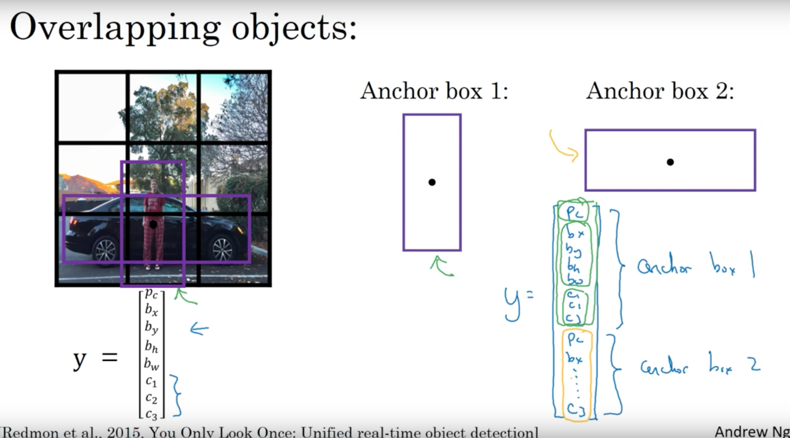
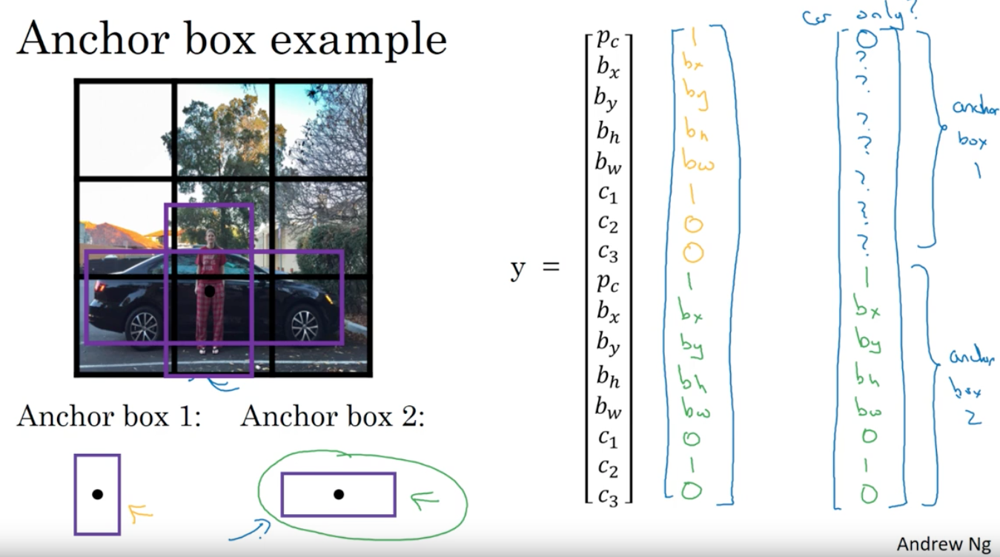

# Deep-Learning-Project

# Reading assignement: [here](https://www.overleaf.com/1241231948txqpkmphvrgq)

# Yolo text: [here](https://arxiv.org/pdf/1612.08242.pdf)

# Proposal project: [here](https://fr.overleaf.com/8691937656zdttxqfydzys)

# Rapport project: [here](https://www.overleaf.com/6328664843mtvcjzzmryzz)

# Ideas : 
- representer d'une facon ou d'une autre qui joue le prochain coup : importante info pour évaluer une position
- interesting read : https://int8.io/chess-position-evaluation-with-convolutional-neural-networks-in-julia/#Chess_position_evaluation_task

- how t use chess library to have the stockfish eval score : https://stackoverflow.com/questions/58556338/python-evaluating-a-board-position-using-stockfish-from-the-python-chess-librar

# video interresante 
 [Batch Norm](https://www.youtube.com/watch?v=em6dfRxYkYU)
 [convolutionnal with Anchor Boxes](https://www.youtube.com/watch?v=RTlwl2bv0Tg) 
 
# Note: Better

## Batch Normalization
Pour augmenter la rapiditer de l'entrainement, on doit normalisé nos inputs d'entrée. De manière general, la normalization est le faite de normalisé nos input d'entrée.
La batch normalisation permet a chaque couche d'un réseau d'apprendre par elle-mêm un peu plus indépendamment des autres couches.

   1.Nous pouvons utiliser des taux d'apprentissage plus élevés car la batch normalisation garantit qu'aucune activation   n'est allée vraiment haut ou très bas. Et par là, des choses qui auparavant ne pouvaient pas s'entraîner, elles commenceront à s'entraîner.

   2.Il réduit le sur-ajustement car il a un léger effet de régularisation. Semblable au décrochage, il ajoute du bruit aux activations de chaque couche cachée. Par conséquent, si nous utilisons la batch normalisation, nous utiliserons moins d'abandon, ce qui est une bonne chose car nous n'allons pas perdre beaucoup d'informations. Cependant, nous ne devons pas dépendre uniquement de la normalisation des batches pour la régularisation; nous devrions mieux l'utiliser avec le décrochage.

### Fonctionnnement
   1. Normalize output from activation function z=(x-m)/s
   2. Multiply nomalized output by arbitraty parameter,g: z \*g
   3. Add arbitrary parameter, b, to resulting product: (z\* g) + b

## High Resloution Classifier

## convolutionnal with Anchor Boxe.
 
 Losrsque l'on détecte des objets dans une images (elle même découpé en cell) on dessine autour un rectangle. Celui-ci est un "Anchor box". La représentationd ce fait comme ci dessous. 
 
 
 
### Anchore box Algorithm. 
 
 Previously: each object in training image is assigned to grid cell that contains tha object's midpoint. 
 
 Output y : 3\*3\*8  (cell.size.height* cell.size.height* anchorBoxSize)
 
 With two anchor boxes: each object in training image is assigned to grid cell that contains object's midpoint and anchor box for the grid cell with highest IoU. 
 
 Output y : 3\*3\*16  (cell.size.height* cell.size.height* anchorBoxSize * anchorBoxSize.number)
 
 ### Exemple
 
 
 
 
 ## Dimention Cluster
 Pour Yolo, on utilise un technique de clustering appelée "Centroid-based" clustering peut gérer seulement des cleusters avec une symétrie sphérique ou elliptique.

Bon comme promis le petit chat.
 

 
 
 # Note: Faster
 # Note: Stronger

Classification. 
Pour classifier yolo combie des étiquettes dans différents jeux de données poour former une structure **arborescente wordTree**.

 
 
