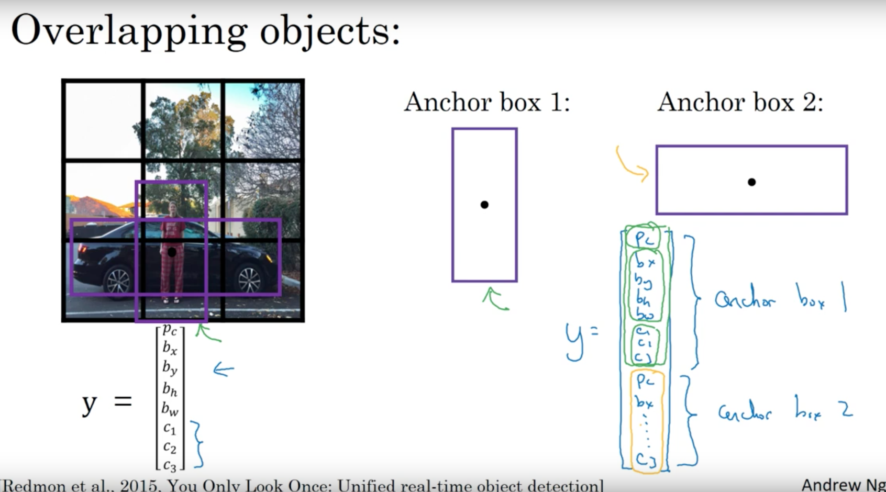

# Note: Better

## Batch Normalization
Pour augmenter la rapiditer de l'entrainement, on doit normalisé nos inputs d'entrée. De manière general, la normalization est le faite de normalisé nos input d'entrée.
La batch normalisation permet a chaque couche d'un réseau d'apprendre par elle-mêm un peu plus indépendamment des autres couches.

  1.Nous pouvons utiliser des taux d'apprentissage plus élevés car la batch normalisation garantit qu'aucune activation   n'est allée vraiment haut ou très bas. Et par là, des choses qui auparavant ne pouvaient pas s'entraîner, elles commenceront à s'entraîner.

  2.Il réduit le sur-ajustement car il a un léger effet de régularisation. Semblable au décrochage, il ajoute du bruit aux activations de chaque couche cachée. Par conséquent, si nous utilisons la batch normalisation, nous utiliserons moins d'abandon, ce qui est une bonne chose car nous n'allons pas perdre beaucoup d'informations. Cependant, nous ne devons pas dépendre uniquement de la normalisation des batches pour la régularisation; nous devrions mieux l'utiliser avec le décrochage.

### Fonctionnnement
  1. Normalize output from activation function z=(x-m)/s
  2. Multiply nomalized output by arbitraty parameter,g: z \*g
  3. Add arbitrary parameter, b, to resulting product: (z\* g) + b

## High Resloution Classifier

## convolutionnal with Anchor Boxe.

Losrsque l'on détecte des objets dans une images (elle même découpé en cell) on dessine autour un rectangle. Celui-ci est un "Anchor box". La représentationd ce fait comme ci dessous.

### Anchore box Algorithm.

Previously: each object in training image is assigned to grid cell that contains tha object's midpoint.

Output y : 3\*3\*8  (cell.size.height* cell.size.height* anchorBoxSize)

With two anchor boxes: each object in training image is assigned to grid cell that contains object's midpoint and anchor box for the grid cell with highest IoU.

Output y : 3\*3\*16  (cell.size.height* cell.size.height* anchorBoxSize * anchorBoxSize.number)

### Exemple

## Dimention Cluster
Pour Yolo, on utilise un technique de clustering appelée "Centroid-based" clustering peut gérer seulement des cleusters avec une symétrie sphérique ou elliptique.

Bon comme promis le petit chat.

# Note: Faster

Pas besoin d'explication suplémentaire.

# Note: Stronger

## Classification.
Pour classifier Yolo combie des étiquettes dans différents jeux de données poour former une structure **arborescente wordTree**. On peut voir que les feuilles de coco deviennes des parents des feuilles de ImageNet.

### Explication.
Nous créons le wordTree ou chaque feuille sortante correspond a une feuille de imageNet et ou chaque noeud parent provient de coco.
Avant la création du **WordTree** Yolo prédissait le score d'etre par exemple un biplan.
Maintenat, avec le **WordTree**, il prédit le score pour le biplan sanchan que c'est un avion.

                                   score(biplan| avion)

Dés lors on peut appliquer une fonction softmax pour calculer la probabilité des scores des feuilles frere. La différence est donc qu'au lieu d'avoir une opération softmax, Yolo effectue plusieurs opérations softmax pour les enfants de chaque parent.

La probabilité de classe est ensuite calculée à partir des proba en remontant dans le **WordTree**

L'avantage de cette hiérarchissation est que si l'on ne peut pas distinguer le type d'avion, YOLO donne un score éleve a Avion au lieu de la forcer dans une sous catégorie.
